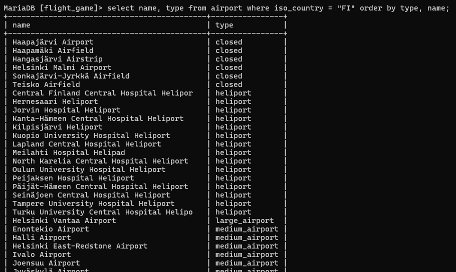

# Viikko 2

## Yhteen tauluun kohdistuvien kyselyjen harjoitukset

### 1. Tee kysely, joka tulostaa kaikki sarakkeet goal-taulusta:

### 2. Tee kysely, joka tulostaa nimen ja tyypin kaikista Suomessa sijaitsevista lentokentistä:

### 3. Tee kysely, joka tulostaa suomalaisten lentokenttien nimet aakkosjärjestyksessä:

### 4. Tee kysely, joka tulostaa nimen ja tyypin kaikista Suomessa sijaitsevista lentokentistä. Järjestä tulos ensisijaisesti tyypin mukaan ja toissijaisesti nimen mukaan:

### 5. Tee kysely, joka tulostaa kaikki F-kirjaimella alkavat maan nimet country-taulusta:

### 6. Tee kysely, joka tulostaa kaikki country-taulun maiden nimet, joissa esiintyy F-kirjain:

### 7. Missä locationissa Vesa sijaitsee?

### 8. Kuinka paljon Ilkka on kuluttanut CO2 budjettia?

## Where-osan liitosehto harjoitukset

### 1. Tee kysely, joka listaa maan nimen ja lentokentän nimen. Valitse maaksi Islanti ja anna country-taulun name-kentälle alias ”country name” ja airport taulun name-kentälle alias ”airport name”.

### 2. Listaa Ranskan isojen lentokenttien nimet. Anna kentän nimelle alias "airport name":

### 3. Tee kysely, joka listaa kaikki Antarktiksella sijaitsevien lentokenttien nimet ja vastaava maan nimi. Käytä aliaksia country_name ja airport_name.

### 4. Kuinka korkealla Heini on paraikaa merenpinnasta mitattuna?

### 5. Kuinka korkealla Heini on paraikaa merenpinnasta mitattuna? Anna tulos metreissä, ja anna tulokselle alias elevation_m.

### 6. Minkä nimisellä lentokentällä Ilkka on?

### 7. Minkä nimisessä maassa Ilkka on?

### 8. Minkä nimiset säätila-tavoitteet Heini on saavuttanut?

### 9. Minkä nimisellä lentokentällä Ilkka saavutti säätilan clouds?