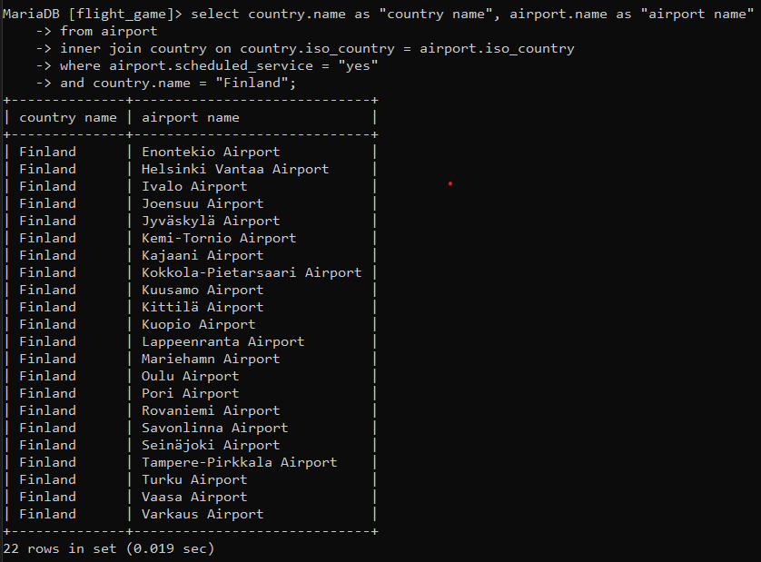
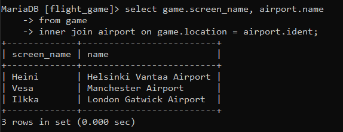
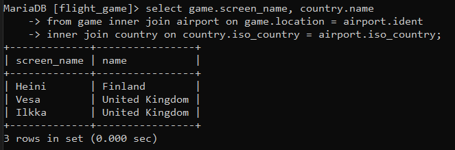
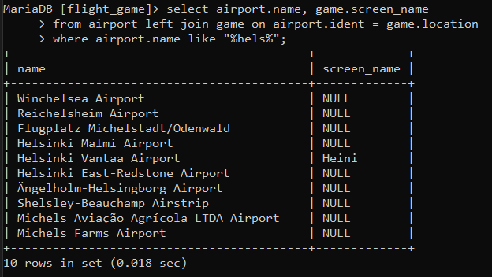
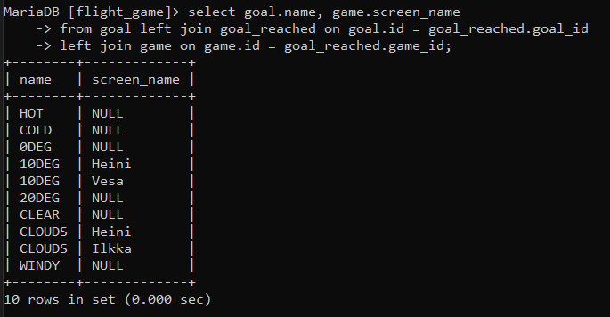
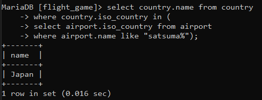
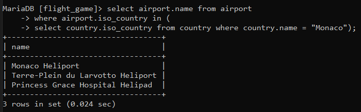
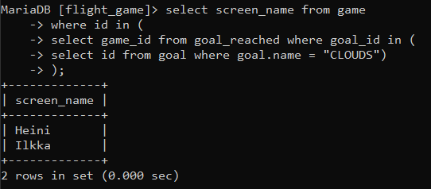
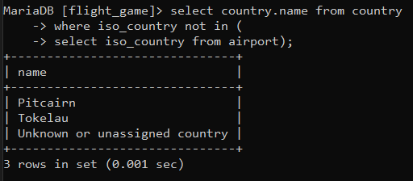
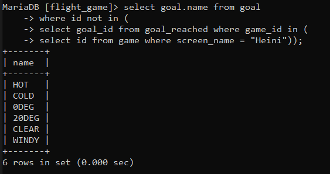

# Viikko 3

## Join-harjoitukset

### 1. Luettele suomalaiset lentokentät, joilla on aikataulutettuja palveluja. Lopputulokseen halutaan sekä maan nimi että lentokentän nimi.

`select country.name as "country name", airport.name as "airport name" from airport inner join country on country.iso_country = airport.iso_country where airport.scheduled_service = "yes" and country.name = "Finland";`

### 2. Luettele pelaajanimet ja niiden lentokenttien nimet, joilla he ovat nyt.

`select game.screen_name, airport.name from game inner join airport on game.location = airport.ident;`

### 3. Luettele pelaajanimet ja maat, joissa he ovat nyt.

`select game.screen_name, country.name from game inner join airport on game.location = airport.ident inner join country on country.iso_country = airport.iso_country;"`

### 4. Luette kaikkien niiden lentokenttien nimet, jotka sisältävät merkkijonon "Hels" ja pelaajan nimi, jos joku pelaaja sattuu ko. kentällä olemaan.

`select airport.name, game.screen_name from airport left join game on airport.ident = game.location where airport.name like "%hels%";`

### 5. Luettele kaikki säätilatavoitteiden nimet ja pelaajan nimi, jos pelaaja on sen saavuttanut.

`select goal.name, game.screen_name from goal left join goal_reached on goal.id = goal_reached.goal_id left join game on game.id = goal_reached.game_id;`

## Sisäkysely-harjoitukset

### 1. Minkä nimisessä maassa sijaitsee sanalla ”Satsuma” alkava lentokenttä?

`select country.name from country where country.iso_country in (select airport.iso_country from airport where airport.name like "%satsuma%");`

### 2. Luettele Monacossa sijaitsevien lentokenttien nimet.

`select airport.name from airport where airport.iso_country in (select country.iso_country from country where country.name = "Monaco");`

### 3. Luettele nimimerkit, jotka ovat saavuttaneet säätilatavoitteen pilvistä (CLOUDS).

`select screen_name from game where id in (select game_id from goal_reached where goal_id in (select id from goal where goal.name = "CLOUDS"));`

### 4. Luettele kaikki maat, joissa ei ole lentokenttää.

`select country.name from country where iso_country not in (select iso_country from airport);`

### 5. Minkä nimiset säätilatavoitteet Heiniltä on saavuttamatta?

`select goal.name from goal where id not in (select goal_id from goal_reached where game_id in (select id from game where screen_name = "Heini"));`

