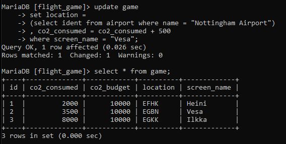
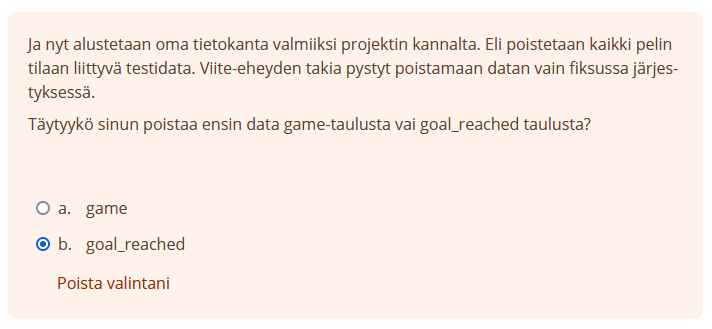
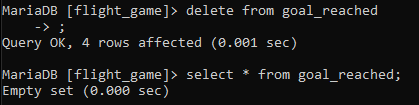
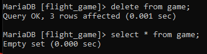

# Viikko 4

## Koostetietokysely-harjoitukset

### 1. Kuinka korkealla sijaitsee korkeimmalla sijaitseva lentokenttä?

`select max(elevation_ft) from airport;`

### 2. Tee kysely, joka listaa kunkin maanosan, ja niissä sijaitsevien maiden määrän.

`select continent, count(*) from country group by continent;`

### 3. Tulosta pelaajien nimimerkit ja pelaajien saavuttamien säätilatavoitteiden lukumäärät.

`select game.screen_name, count(*) from game, goal_reached where game.id = goal_reached.game_id group by screen_name;`

### 4. Mikä nimimerkki on kuluttanut vähiten hiilijalanjälkeä?

`select screen_name from game where co2_consumed in (select min(co2_consumed) from game);`

### 5. Tulosta maan nimi ja lentokenttien lukumäärä kyseisessä maassa. Järjestä tulokset siten, että ylimpänä listassa ovat maat, joissa on eniten lentokenttiä. Ota mukaan vain 50 eniten lentokenttiä sisältävää maata.

`select country.name, count(*) from country, airport where airport.iso_country = country.iso_country group by country.name order by count(*) desc limit 50;`

### 6. Tulosta niiden maiden nimi, joissa on yli 1000 lentokenttää.

`select country.name from country, airport where airport.iso_country = country.iso_country group by airport.iso_country having count(*) > 1000;`

### 7. Minkä niminen on maailman korkeimmalla sijaitseva lentokenttä?

`select name from airport where elevation_ft in (select max(elevation_ft) from airport);`

### 8. Missä maassa sijaitsee maailman korkeimmalla oleva lentokenttä?

`select country.name from country where country.iso_country in (select iso_country from airport where elevation_ft in (select max(elevation_ft) from airport));`

### 9. Kuinka monta säätilatavoitetta Vesa on saavuttanut?

`select count(*) from goal_reached where game_id in (select id from game where screen_name = "Vesa");`

### 10. Mikä on lähimpänä napa-alueita olevan lentokentän nimi?

`select name from airport where latitude_deg in (select min(latitude_deg) from airport);`

## Päivityskyselyharjoitukset

### 1. Vesa lentää nykyiseltä sijainnilta Nottingham Airport:lle. Samalla Vesan hiilijalanjälki kasvaa 500:lla. Päivitä nämä tiedot tietokantaan.

`update game set location = (select ident from airport where name = "Nottingham Airport"), co2_consumed = co2_consumed + 500 where screen_name = "Vesa";`

### 2. Ja nyt alustetaan oma tietokanta valmiiksi projektin kannalta. Eli poistetaan kaikki pelin tilaan liittyvä testidata. Viite-eheyden takia pystyt poistamaan datan vain fiksussa järjestyksessä. Täytyykö sinun poistaa ensin data game-taulusta vai goal_reached taulusta?

Vastaus: goal_reached

### 3. Poista data goal_reahed-taulusta

`delete from goal_reached;`

### 4. Poista data game-taulusta

`delete from game;`

