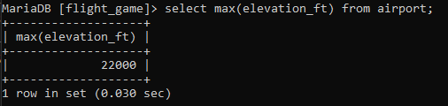
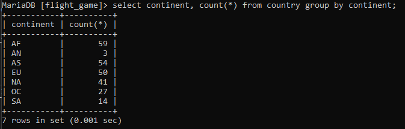
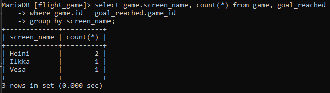
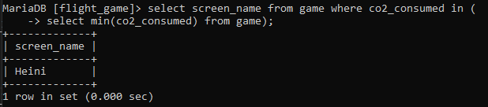
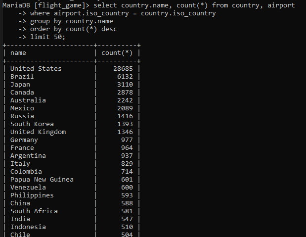
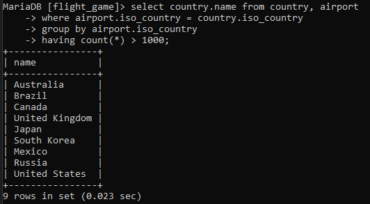
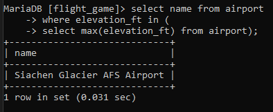
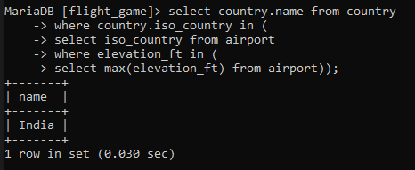
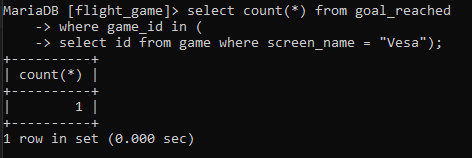
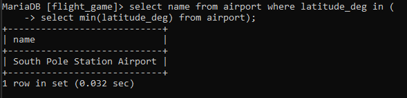

# Viikko 4

## Koostetietokysely-harjoitukset

### 1. Kuinka korkealla sijaitsee korkeimmalla sijaitseva lentokenttä?

### 2. Tee kysely, joka listaa kunkin maanosan, ja niissä sijaitsevien maiden määrän.

### 3. Tulosta pelaajien nimimerkit ja pelaajien saavuttamien säätilatavoitteiden lukumäärät.

### 4. Mikä nimimerkki on kuluttanut vähiten hiilijalanjälkeä?

### 5. Tulosta maan nimi ja lentokenttien lukumäärä kyseisessä maassa. Järjestä tulokset siten, että ylimpänä listassa ovat maat, joissa on eniten lentokenttiä. Ota mukaan vain 50 eniten lentokenttiä sisältävää maata.

### 6. Tulosta niiden maiden nimi, joissa on yli 1000 lentokenttää.

### 7. Minkä niminen on maailman korkeimmalla sijaitseva lentokenttä?

### 8. Missä maassa sijaitsee maailman korkeimmalla oleva lentokenttä?

### 9. Kuinka monta säätilatavoitetta Vesa on saavuttanut?

### 10. Mikä on lähimpänä napa-alueita olevan lentokentän nimi?

